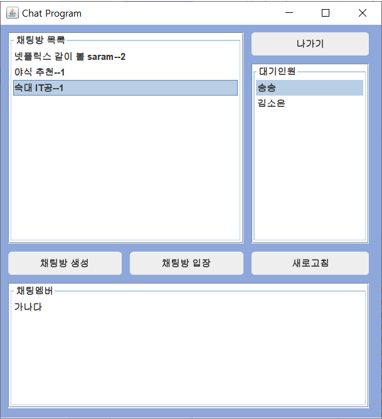
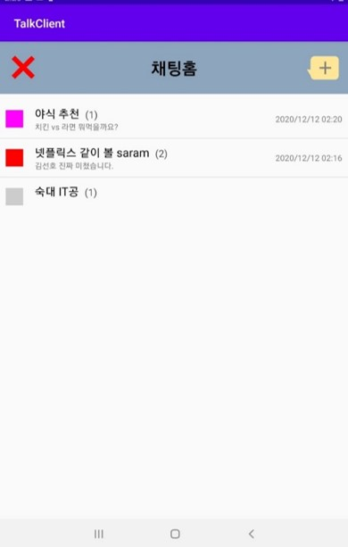
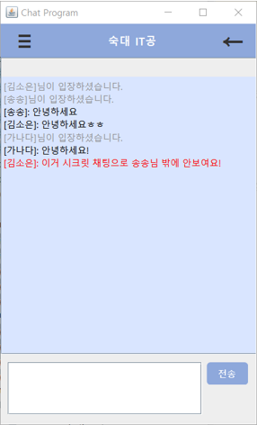
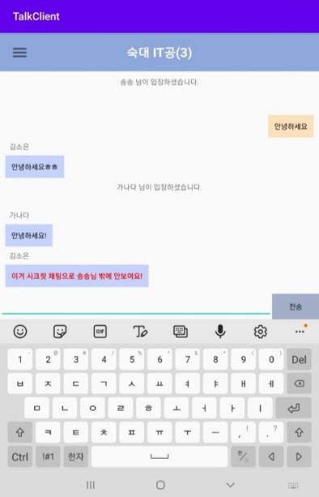

# Chat
소켓을 통한 자바, 안드로이드 채팅 프로그램

자바 언어로 구축된 서버를 구동시키면 클라이언트(자바, 안드로이드)의 채팅 프로그램을 실행할 수 있습니다.

  
안드로이드에서는 채팅방 목록에 최근 채팅 메시지 및 시간이 표시됩니다. 
   
비밀챗을 통해 단체방 내에서 1:1로 채팅이 가능합니다. 

   

기능
- 소켓을 통한 통신
- 각 채널별로 들어갈 수 있는 채팅방
- 최신 채팅방순으로 정렬
- 비밀챗
